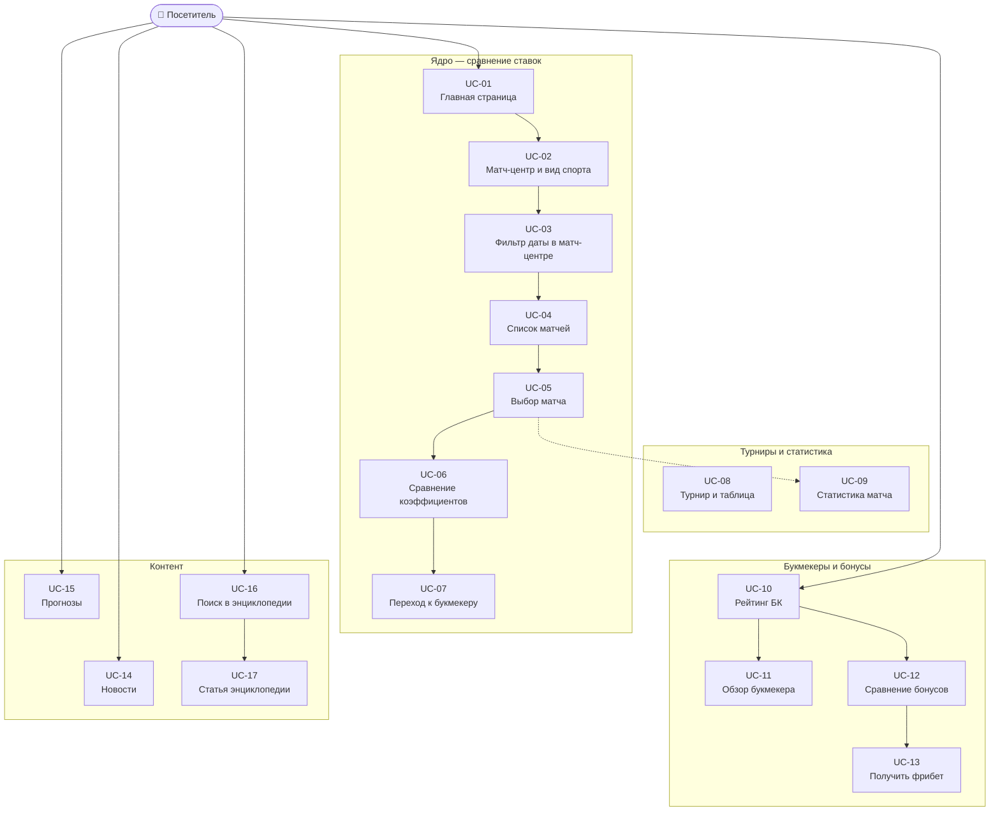

# Лабораторная работа №3

Выполнили: Батаргин Егор Александрович, Лазарев Дмитрий Иванович

## Задание

Требования к выполнению работы:

- Тестовое покрытие должно быть сформировано на основании набора прецедентов использования сайта.
- Тестирование должно осуществляться автоматически — с помощью системы автоматизированного тестирования Selenium.
- Шаблоны тестов должны формироваться при помощи Selenium IDE и исполняться при помощи Selenium RC в браузерах Firefox и Chrome.
- Предполагается, что тестируемый сайт использует динамическую генерацию элементов на странице, т.е. выбор элемента в DOM должен осуществляться не на основании его ID, а с помощью XPath.

**Сайт:** [https://sravni.bet/](https://sravni.bet/)

---

## О тестируемом сайте

**Сравни.бет** — портал о ставках на спорт: сравнение коэффициентов легальных букмекеров, рейтинги БК, матч-центр, новости, прогнозы и энциклопедия. Интерфейс построен на Next.js; матчи и котировки подгружаются динамически. Регистрация для просмотра не требуется.

**Актор:** посетитель (неавторизованный пользователь).

---

## Диаграмма прецедентов (Use Case)




---

## Описание прецедентов

Ниже прецеденты оформлены таблицами в стиле слайда (без шапки «Поле/Значение»).

### Прецедент UC-01


| Прецедент: OpenMainPage |                                                                                                                       |
| ----------------------- | --------------------------------------------------------------------------------------------------------------------- |
| ID                      | UC-01                                                                                                                 |
| Краткое описание        | Пользователь открывает главную страницу сайта                                                                         |
| Главные актёры          | Посетитель                                                                                                            |
| Второстепенные актёры   | Нет                                                                                                                   |
| Предусловия             | Браузер запущен, есть доступ к интернету                                                                              |
| Основной поток          | Пользователь переходит на `https://sravni.bet/`; система загружает главную страницу с матчами и карточками букмекеров |
| Постусловия             | Главная страница отображена                                                                                           |


### Прецедент UC-02


| Прецедент: SelectSport |                                                                                                  |
| ---------------------- | ------------------------------------------------------------------------------------------------ |
| ID                     | UC-02                                                                                            |
| Краткое описание       | Пользователь открывает матч-центр и выбирает вид спорта                                        |
| Главные актёры         | Посетитель                                                                                       |
| Второстепенные актёры  | Нет                                                                                              |
| Предусловия            | Открыта главная страница                                                                         |
| Основной поток         | Пользователь нажимает «Все матчи» → переход в матч-центр `/stat/football/` (заголовок про футбол, список матчей); затем выбирает вкладку спорта (теннис/хоккей/MMA); система переходит на URL вида `/stat/tennis/`, `/stat/hockey/` и обновляет заголовок и список матчей |
| Постусловия            | Открыт матч-центр выбранного спорта; URL, заголовок и список матчей соответствуют виду спорта   |


### Прецедент UC-03


| Прецедент: FilterByDateInMatchCenter |                                                                                                                                    |
| ------------------------------------ | ---------------------------------------------------------------------------------------------------------------------------------- |
| ID                                   | UC-03                                                                                                                              |
| Краткое описание                     | Пользователь выбирает дату в матч-центре                                                                                           |
| Главные актёры                       | Посетитель                                                                                                                         |
| Второстепенные актёры                | Нет                                                                                                                                |
| Предусловия                          | Открыт матч-центр (`«Все матчи»` → `/stat/football/`)                                                                               |
| Основной поток                       | Пользователь выбирает дату одним из способов: кнопка «Вчера», кнопка «Завтра» или календарь с произвольной датой; система обновляет URL, заголовок и список матчей |
| Постусловия                          | Отображаются матчи выбранной даты (`/yesterday/`, `/tomorrow/` или `?date=yyyy-MM-dd`)                                              |


### Прецедент UC-04


| Прецедент: ViewMatchList |                                                         |
| ------------------------ | ------------------------------------------------------- |
| ID                       | UC-04                                                   |
| Краткое описание         | Пользователь просматривает список матчей на главной     |
| Главные актёры           | Посетитель                                              |
| Второстепенные актёры    | Нет                                                     |
| Предусловия              | Открыта главная после фильтрации/выбора спорта          |
| Основной поток           | Система отображает турниры, команды и ссылки на события |
| Постусловия              | Пользователь может выбрать конкретный матч              |


### Прецедент UC-05


| Прецедент: OpenMatchPage |                                                                              |
| ------------------------ | ---------------------------------------------------------------------------- |
| ID                       | UC-05                                                                        |
| Краткое описание         | Пользователь открывает страницу выбранного матча                             |
| Главные актёры           | Посетитель                                                                   |
| Второстепенные актёры    | Нет                                                                          |
| Предусловия              | Доступен список матчей со ссылками `/stat/futbol/{id}/`                      |
| Основной поток           | Пользователь кликает по матчу; система открывает страницу события с деталями |
| Постусловия              | Страница матча загружена                                                     |


### Прецедент UC-06


| Прецедент: CompareOdds |                                                                      |
| ---------------------- | -------------------------------------------------------------------- |
| ID                     | UC-06                                                                |
| Краткое описание       | Пользователь сравнивает коэффициенты разных букмекеров               |
| Главные актёры         | Посетитель                                                           |
| Второстепенные актёры  | Нет                                                                  |
| Предусловия            | На главной есть карточки `betCard`                                   |
| Основной поток         | Пользователь анализирует коэффициенты П1/X/П2 в нескольких карточках |
| Постусловия            | Выбран наиболее подходящий коэффициент                               |


### Прецедент UC-07


| Прецедент: OpenBookmakerSite |                                                                             |
| ---------------------------- | --------------------------------------------------------------------------- |
| ID                           | UC-07                                                                       |
| Краткое описание             | Пользователь переходит на сайт букмекера из карточки коэффициента           |
| Главные актёры               | Посетитель                                                                  |
| Второстепенные актёры        | Партнёрский трекинг-сервис                                                  |
| Предусловия                  | На странице есть кликабельный `betCard`                                     |
| Основной поток               | Пользователь нажимает карточку; система открывает новую вкладку/внешний URL |
| Постусловия                  | Открыт сайт букмекера                                                       |


### Прецедент UC-08


| Прецедент: ViewTournament |                                                                                 |
| ------------------------- | ------------------------------------------------------------------------------- |
| ID                        | UC-08                                                                           |
| Краткое описание          | Пользователь открывает страницу турнира                                         |
| Главные актёры            | Посетитель                                                                      |
| Второстепенные актёры     | Нет                                                                             |
| Предусловия               | Известна ссылка турнира `/stat/futbol/tournament/{id}/`                         |
| Основной поток            | Пользователь открывает страницу турнира; система отображает календарь и таблицу |
| Постусловия               | Информация о турнире доступна                                                   |


### Прецедент UC-09


| Прецедент: ViewMatchStatistics |                                                                        |
| ------------------------------ | ---------------------------------------------------------------------- |
| ID                             | UC-09                                                                  |
| Краткое описание               | Пользователь просматривает статистику конкретного матча                |
| Главные актёры                 | Посетитель                                                             |
| Второстепенные актёры          | Нет                                                                    |
| Предусловия                    | Открыта страница матча                                                 |
| Основной поток                 | Система отображает блоки «События», «Личные встречи», «Состав команды» |
| Постусловия                    | Статистика матча просмотрена                                           |


### Прецедент UC-10


| Прецедент: ViewBookmakerRating |                                                                              |
| ------------------------------ | ---------------------------------------------------------------------------- |
| ID                             | UC-10                                                                        |
| Краткое описание               | Пользователь просматривает рейтинг букмекеров                                |
| Главные актёры                 | Посетитель                                                                   |
| Второстепенные актёры          | Нет                                                                          |
| Предусловия                    | Доступен раздел `/bukmekery/luchshie/`                                       |
| Основной поток                 | Пользователь открывает страницу рейтинга; система показывает топ БК и оценки |
| Постусловия                    | Рейтинг букмекеров доступен для выбора                                       |


### Прецедент UC-11


| Прецедент: ViewBookmakerReview |                                                                           |
| ------------------------------ | ------------------------------------------------------------------------- |
| ID                             | UC-11                                                                     |
| Краткое описание               | Пользователь открывает страницу конкретного букмекера                     |
| Главные актёры                 | Посетитель                                                                |
| Второстепенные актёры          | Нет                                                                       |
| Предусловия                    | Доступна ссылка букмекера (`/fonbet/`, `/winline/` и т.д.)                |
| Основной поток                 | Пользователь открывает страницу обзора; система показывает описание и CTA |
| Постусловия                    | Просмотрена карточка/обзор букмекера                                      |


### Прецедент UC-12


| Прецедент: CompareBonuses |                                                            |
| ------------------------- | ---------------------------------------------------------- |
| ID                        | UC-12                                                      |
| Краткое описание          | Пользователь сравнивает бонусные предложения букмекеров    |
| Главные актёры            | Посетитель                                                 |
| Второстепенные актёры     | Нет                                                        |
| Предусловия               | Доступен раздел фрибетов `/bukmekery/luchshie-fribety/`    |
| Основной поток            | Пользователь просматривает список бонусов и суммы фрибетов |
| Постусловия               | Выбран подходящий бонус                                    |


### Прецедент UC-13


| Прецедент: GetFreebet |                                                                                 |
| --------------------- | ------------------------------------------------------------------------------- |
| ID                    | UC-13                                                                           |
| Краткое описание      | Пользователь нажимает «Получить фрибет»                                         |
| Главные актёры        | Посетитель                                                                      |
| Второстепенные актёры | Партнёрский трекинг-сервис                                                      |
| Предусловия           | На странице есть кнопка «Получить фрибет»                                       |
| Основной поток        | Пользователь нажимает кнопку; система переводит на внешнюю партнёрскую страницу |
| Постусловия           | Переход на страницу получения фрибета выполнен                                  |


### Прецедент UC-14


| Прецедент: ReadNews   |                                                                                                   |
| --------------------- | ------------------------------------------------------------------------------------------------- |
| ID                    | UC-14                                                                                             |
| Краткое описание      | Пользователь открывает и читает новость                                                           |
| Главные актёры        | Посетитель                                                                                        |
| Второстепенные актёры | Нет                                                                                               |
| Предусловия           | Доступен раздел `/mag/novosti/`                                                                   |
| Основной поток        | Пользователь открывает список новостей и выбирает первую запись; система показывает текст новости |
| Постусловия           | Статья новости открыта                                                                            |


### Прецедент UC-15


| Прецедент: ReadForecast |                                                                                     |
| ----------------------- | ----------------------------------------------------------------------------------- |
| ID                      | UC-15                                                                               |
| Краткое описание        | Пользователь открывает и читает прогноз на матч                                     |
| Главные актёры          | Посетитель                                                                          |
| Второстепенные актёры   | Нет                                                                                 |
| Предусловия             | Доступен раздел `/prognozy/football/`                                               |
| Основной поток          | Пользователь открывает первую статью прогноза; система показывает страницу прогноза |
| Постусловия             | Статья прогноза открыта                                                             |


### Прецедент UC-16


| Прецедент: SearchInEncyclopedia |                                                                                                             |
| ------------------------------- | ----------------------------------------------------------------------------------------------------------- |
| ID                              | UC-16                                                                                                       |
| Краткое описание                | Пользователь выполняет поиск в энциклопедии                                                                 |
| Главные актёры                  | Посетитель                                                                                                  |
| Второстепенные актёры           | Нет                                                                                                         |
| Предусловия                     | Открыта страница `/enciklopediya/`                                                                          |
| Основной поток                  | Пользователь вводит запрос (например, «тотал») и нажимает «Найти»; система показывает релевантные материалы |
| Постусловия                     | Получен список результатов поиска                                                                           |


### Прецедент UC-17


| Прецедент: OpenEncyclopediaArticle |                                                                                        |
| ---------------------------------- | -------------------------------------------------------------------------------------- |
| ID                                 | UC-17                                                                                  |
| Краткое описание                   | Пользователь открывает статью энциклопедии                                             |
| Главные актёры                     | Посетитель                                                                             |
| Второстепенные актёры              | Нет                                                                                    |
| Предусловия                        | Есть ссылка на статью из результатов поиска или прямой URL                             |
| Основной поток                     | Пользователь открывает статью; система показывает заголовок и основной текст материала |
| Постусловия                        | Статья энциклопедии просмотрена                                                        |


Для каждого прецедента **UC-01 … UC-17** предусмотрен отдельный автотест Selenium (сценарий **TS-01 … TS-17**). Тесты выполняются в **Chrome** и **Firefox**.

---

## Тестовые сценарии для Selenium

Локаторы — **XPath** (без привязки к динамическим `id` и хеш-классам CSS Modules). В колонке «Пример XPath» — ориентиры для реализации; при изменении вёрстки уточнять в DevTools (`$x("...")`).

### Таблица сценариев в формате состояний (как в отчёте)


| №          | Начальное состояние                     | Ввод                                                          | Действие системы                            | Вывод                                             | Конечное состояние                 |
| ---------- | --------------------------------------- | ------------------------------------------------------------- | ------------------------------------------- | ------------------------------------------------- | ---------------------------------- |
| 1 (UC-01)  | Браузер закрыт / страница не открыта    | Открываем `https://sravni.bet/`                               | Система загружает главную страницу          | Видны блок матчей, карточки букмекеров, навигация | Главная страница загружена         |
| 2 (UC-02)  | Главная страница загружена              | Клик «Все матчи», проверка футбольного матч-центра, затем вкладка «теннис» | Открытие матч-центра и смена вида спорта | URL `/stat/football/` → `/stat/tennis/`; заголовок и список матчей обновлены | Матч-центр выбранного спорта |
| 3 (UC-03)  | Матч-центр `/stat/football/` открыт     | «Вчера» / «Завтра» / дата в календаре (с возвратом на «сегодня») | Переключение периода в матч-центре          | URL `/yesterday/`, `/tomorrow/`, `?date=`; список матчей обновлён | Матч-центр на выбранной дате      |
| 4 (UC-04)  | Главная после фильтрации                | Прокрутка к списку матчей                                     | Отрисовка списка событий с ссылками         | Видны строки матчей и ссылки `/stat/futbol/...`   | Список матчей доступен             |
| 5 (UC-05)  | Список матчей доступен                  | Клик по первой ссылке матча                                   | Переход на страницу события                 | Открыт URL `/stat/futbol/{id}/`                   | Страница матча открыта             |
| 6 (UC-06)  | Главная страница загружена              | Анализ двух и более `betCard`                                 | Система отображает коэффициенты разных БК   | Найдено ≥2 карточек с различными значениями       | Коэффициенты сравнены              |
| 7 (UC-07)  | Главная, есть `betCard`                 | Клик по `betCard`                                             | Система выполняет партнёрский переход       | Открывается новая вкладка / внешний URL           | Переход на сайт букмекера выполнен |
| 8 (UC-08)  | Вне страницы турнира                    | Открываем `/stat/futbol/tournament/667/`                      | Загрузка страницы турнира                   | Видны календарь/таблица/описание турнира          | Страница турнира открыта           |
| 9 (UC-09)  | Страница матча открыта                  | Проверка блоков статистики                                    | Система отображает секции матча             | Видны «Личные встречи»/«Состав команды»/«События» | Статистика матча доступна          |
| 10 (UC-10) | Вне раздела БК                          | Открываем `/bukmekery/luchshie/`                              | Загрузка рейтинга букмекеров                | В тексте присутствуют FONBET/Winline и др.        | Рейтинг БК открыт                  |
| 11 (UC-11) | Вне обзора букмекера                    | Открываем `/fonbet/` (или другой БК)                          | Загрузка страницы обзора БК                 | Видны название, рейтинг, описание, CTA            | Обзор букмекера открыт             |
| 12 (UC-12) | Вне раздела бонусов                     | Открываем `/bukmekery/luchshie-fribety/`                      | Загрузка витрины бонусов                    | Видны фрибеты/суммы/карточки БК                   | Раздел бонусов открыт              |
| 13 (UC-13) | Главная или бонусы открыты              | Клик «Получить фрибет»                                        | Выполняется партнёрский редирект            | Открыт внешний URL/новая вкладка                  | Переход за фрибетом выполнен       |
| 14 (UC-14) | Вне раздела новостей                    | Открываем `/mag/novosti/` и кликаем новость                   | Переход на страницу новости                 | URL вида `/mag/novosti/...`, текст статьи         | Новость открыта                    |
| 15 (UC-15) | Вне раздела прогнозов                   | Открываем `/prognozy/football/`, открываем первую статью      | Переход на страницу прогноза                | URL `/prognozy/...` и контент статьи              | Прогноз открыт                     |
| 16 (UC-16) | Энциклопедия не открыта                 | Открываем `/enciklopediya/`, вводим «тотал», нажимаем «Найти» | Выполняется поиск по энциклопедии           | Показаны результаты по запросу                    | Результаты поиска отображены       |
| 17 (UC-17) | В результатах энциклопедии / прямой URL | Открываем статью `.../total-4-5-bolshe...`                    | Загрузка страницы статьи                    | Виден заголовок и основной текст                  | Статья энциклопедии открыта        |


| ID        | Прецедент | Предусловия                       | Шаги                                                                                                                             | Ожидаемый результат                                                                                 | Пример XPath                                                           |
| --------- | --------- | --------------------------------- | -------------------------------------------------------------------------------------------------------------------------------- | --------------------------------------------------------------------------------------------------- | ---------------------------------------------------------------------- |
| **TS-01** | UC-01     | Браузер запущен                   | 1. Открыть `https://sravni.bet/` 2. Дождаться загрузки (явное ожидание)                                                          | URL содержит `sravni.bet`; в заголовке или теле страницы есть тема ставок/матчей; виден блок матчей | `//h1[contains(.,'Матчи')]` или `//button[contains(@class,'betCard')]` |
| **TS-02** | UC-02     | Открыта главная                   | 1. Кликнуть «Все матчи» 2. Дождаться URL `/stat/football/` и заголовка про футбол 3. Кликнуть вкладку «теннис» 4. Дождаться смены URL и списка | URL `/stat/football/` → `/stat/tennis/`; заголовок и список матчей обновлены | `//a[contains(@href,'/stat/football/')]//*[normalize-space()='Все матчи']`, `//a[contains(@href,'/stat/tennis/')]` |
| **TS-03** | UC-03     | Матч-центр открыт                 | 1. «Все матчи» → `/stat/football/` 2. «Вчера» 3. Вернуться на «сегодня», «Завтра» 4. Снова на «сегодня», дата в календаре | URL `/yesterday/`, `/tomorrow/`, `?date=`; перед каждым способом — страница «сегодня» с кнопками Вчера/Сегодня/Завтра | `//button[contains(@class,'dateTag') and contains(.,'Вчера')]`, `//div[@data-qa='Calendar']` |
| **TS-04** | UC-04     | Открыта главная, выбран футбол    | 1. Прокрутить к списку турниров 2. Проверить наличие строк матчей                                                                | Есть минимум одна ссылка на матч `/stat/futbol/` и отображаются названия команд                     | `//a[contains(@href,'/stat/futbol/')]`                                 |
| **TS-05** | UC-05     | Открыта главная                   | 1. Кликнуть первую ссылку на матч 2. Дождаться загрузки страницы события                                                         | URL вида `/stat/futbol/{id}/`; в заголовке — имена команд; есть блоки «Состав» или «Личные встречи» | `//a[contains(@href,'/stat/futbol/')][1]`                              |
| **TS-06** | UC-06     | Открыта главная                   | 1. Найти первый матч с кнопками `betCard` 2. Считать коэффициенты с двух разных карточек                                         | Не менее двух карточек с числовым коэффициентом; логотипы/названия БК различаются                   | `//button[contains(@class,'betCard')]`                                 |
| **TS-07** | UC-07     | Открыта главная                   | 1. Запомнить `window_handles` 2. Кликнуть первую `betCard` 3. `WebDriverWait` до появления новой вкладки 4. Переключиться на неё | Число вкладок +1; URL новой вкладки **не** содержит `sravni.bet`                                    | `//button[contains(@class,'betCard')][1]`                              |
| **TS-08** | UC-08     | —                                 | 1. Открыть `/stat/futbol/tournament/667/`                                                                                        | Заголовок турнира; блок «Календарь» с матчами                                                       | `//h1[contains(.,'товарищеск')]`                                       |
| **TS-09** | UC-09     | Открыта страница матча            | 1. Проверить наличие ключевых блоков на странице события                                                                         | Видны счёт/статус; секция «Личные встречи» или «Состав команды»                                     | `//*[contains(.,'Личные встречи')]`                                    |
| **TS-10** | UC-10     | —                                 | 1. Открыть `/bukmekery/luchshie/`                                                                                                | В тексте есть рейтинг/топ букмекеров; упоминаются FONBET, Winline и др.                             | `//*[contains(.,'FONBET') or contains(.,'Winline')]`                   |
| **TS-11** | UC-11     | —                                 | 1. Открыть `/fonbet/` (или `/winline/`)                                                                                          | Отображается название букмекера, рейтинг, описание; есть ссылка/кнопка перехода на сайт БК          | `//h1[contains(.,'FONBET') or contains(.,'Фонбет')]`                   |
| **TS-12** | UC-12     | —                                 | 1. Открыть `/bukmekery/luchshie-fribety/`                                                                                        | Список бонусов/фрибетов с суммами; карточки нескольких букмекеров                                   | `//*[contains(.,'фрибет') or contains(.,'Фрибет')]`                    |
| **TS-13** | UC-13     | Открыта главная или `/bukmekery/` | 1. Клик «Получить фрибет» у карточки PARI/Fonbet 2. Дождаться новой вкладки                                                      | Новая вкладка; переход на партнёрский домен                                                         | `//*[contains(normalize-space(),'Получить фрибет')]`                   |
| **TS-14** | UC-14     | —                                 | 1. Открыть `/mag/novosti/` 2. Кликнуть первую новость                                                                            | URL статьи `/mag/novosti/...`; открыт текст новости                                                 | `//a[contains(@href,'/mag/novosti/')][1]`                              |
| **TS-15** | UC-15     | —                                 | 1. Открыть `/prognozy/football/` 2. Кликнуть «Подробнее» у первого прогноза                                                      | Открыта страница прогноза с развёрнутым текстом                                                     | `//a[contains(.,'Подробнее')][1]`                                      |
| **TS-16** | UC-16     | —                                 | 1. Открыть `https://sravni.bet/enciklopediya/` 2. Ввести в поле поиска «тотал» 3. Нажать «Найти»                                 | Отображаются результаты со ссылками на статьи по теме ставок                                        | `//*[normalize-space()='Найти']`                                       |
| **TS-17** | UC-17     | TS-16 пройден или прямой переход  | 1. Открыть `/enciklopediya/shkola-bettinga/total-4-5-bolshe-tb-4-5/` 2. Проверить содержимое статьи                              | Заголовок статьи про тотал; основной текст отображается                                             | `//h1[contains(.,'тотал') or contains(.,'Тотал')]`                     |


### Технические требования к реализации


| Требование       | Реализация                                                                                                      |
| ---------------- | --------------------------------------------------------------------------------------------------------------- |
| Запись шаблона   | Selenium IDE → экспорт Java JUnit                                                                               |
| Запуск           | WebDriver (ChromeDriver, FirefoxDriver); для задания про «RC» — Grid + `RemoteWebDriver` или пояснение в отчёте |
| Ожидания         | `WebDriverWait` + `ExpectedConditions`, не `Thread.sleep`                                                       |
| Завершение теста | `driver.quit()` в `@After`                                                                                      |
| Проверки         | `assertTrue`, `assertEquals` на URL, текст, число окон                                                          |
| Локаторы         | Только `By.xpath(...)` в финальной версии тестов                                                                |


---

## Selenium

**Selenium** — набор инструментов для автоматизации браузера. В работе используется цепочка:

1. **Selenium IDE** — запись действий в браузере, экспорт теста на Java (JUnit).
2. **Selenium WebDriver** — исполнение теста (Chrome / Firefox через chromedriver / geckodriver).
3. **Selenium Grid** (опционально) — удалённый запуск; соответствует требованию про Selenium RC в формулировке задания.

Для генерации заготовки Page Object можно использовать расширение **Selenium Generate Page Object**; селекторы в экспорте нужно заменить на устойчивые XPath.

**Пример явного ожидания (Java):**

```java
WebDriverWait wait = new WebDriverWait(driver, Duration.ofSeconds(15));
WebElement tab = wait.until(ExpectedConditions.elementToBeClickable(
    By.xpath("//span[@data-qa='Tag'][2]")
));
tab.click();
```

### Структура проекта

```
TPO_3_Lab/
├── build.gradle
├── legacy/                              # исходники для отчёта (не в сборке)
│   ├── selenium-ide/UntitledTest.java   # экспорт Selenium IDE
│   ├── page-object-generator/MainPage.java
│   └── README.md                        # таблица «было → стало»
├── src/test/java/ru/itmo/tpo/lab3/      # финальная доработанная версия
│   ├── SravniBetUseCaseTests.java       # TS-01 … TS-17
│   ├── pages/MainPage.java              # Page Object на XPath
│   └── support/                         # WebDriver, локаторы, ожидания
```

Для преподавателя: в `legacy/` — что получено из **Selenium IDE** и **Page Object Generator**; в `src/test/` — что доработано под требования лабы (XPath, 17 прецедентов, Chrome/Firefox, assert).

### Запуск тестов (Gradle)

```bash
# Все прецеденты, Chrome + Firefox (38 прогонов)
./gradlew test

# Только Chrome
./gradlew test -Dbrowser=chrome

# Только Firefox
./gradlew test -Dbrowser=firefox

# Один сценарий
./gradlew test -Dbrowser=chrome --tests "*ts07*"
```

Требуется JDK 17+ и установленные Chrome / Firefox.

---

## Отчёт для сдачи

Полный текст отчёта (структура как в ЛР2): **[docs/Отчет_ЛР3.md](docs/Отчет_ЛР3.md)** — скопируйте в Яндекс Документы, добавьте титульный лист и скриншоты.

## Выводы

*Заполнить после выполнения лабораторной.*

Рекомендуемые тезисы для отчёта:

- Покрытие построено на 17 прецедентах; каждый прецедент реализован отдельным автотестом (TS-01–TS-17) в Chrome и Firefox.
- Динамическая вёрстка (CSS Modules, Next.js) делает селекторы по `id` и хеш-классам ненадёжными; XPath по тексту, `href`, `data-qa` устойчивее.
- Критический сценарий — сравнение коэффициентов и переход к букмекеру (новая вкладка).
- Запись Selenium IDE требует доработки: явные ожидания, assert, XPath, прогон в двух браузерах.

