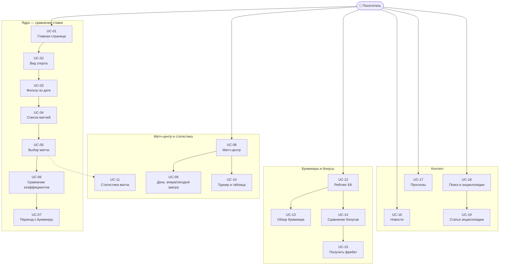

# Лабораторная работа №3

Выполнили: Батаргин Егор Александрович, Лазарев Дмитрий Иванович

## Задание

Требования к выполнению работы:

- Тестовое покрытие должно быть сформировано на основании набора прецедентов использования сайта.
- Тестирование должно осуществляться автоматически — с помощью системы автоматизированного тестирования Selenium.
- Шаблоны тестов должны формироваться при помощи Selenium IDE и исполняться при помощи Selenium RC в браузерах Firefox и Chrome.
- Предполагается, что тестируемый сайт использует динамическую генерацию элементов на странице, т.е. выбор элемента в DOM должен осуществляться не на основании его ID, а с помощью XPath.

**Сайт:** [https://sravni.bet/](https://sravni.bet/)

---

## О тестируемом сайте

**Сравни.бет** — портал о ставках на спорт: сравнение коэффициентов легальных букмекеров, рейтинги БК, матч-центр, новости, прогнозы и энциклопедия. Интерфейс построен на Next.js; матчи и котировки подгружаются динамически. Регистрация для просмотра не требуется.

**Актор:** посетитель (неавторизованный пользователь).

---

## Диаграмма прецедентов (Use Case)




---

## Описание прецедентов

### Ядро — сравнение ставок


| ID        | Название                            | Описание                                                                                                                                       |
| --------- | ----------------------------------- | ---------------------------------------------------------------------------------------------------------------------------------------------- |
| **UC-01** | Открытие главной страницы           | Посетитель открывает `https://sravni.bet/`. Отображаются блок матчей на сегодня, вкладки видов спорта, турниры, карточки букмекеров и новости. |
| **UC-02** | Выбор вида спорта                   | На главной переключаются вкладки: футбол, теннис, хоккей, MMA и др. Список событий обновляется под выбранный вид спорта.                       |
| **UC-03** | Фильтрация матчей по дате (главная) | Переключение тегов-фильтров (`data-qa="Tag"`) меняет набор турниров и матчей на главной.                                                       |
| **UC-04** | Просмотр списка матчей              | Матчи сгруппированы по турнирам: время, команды, статус. Доступно «Показать ещё».                                                              |
| **UC-05** | Выбор матча                         | Клик по событию ведёт на страницу матча `/stat/futbol/{id}/` с составами, H2H и статистикой.                                                   |
| **UC-06** | Сравнение коэффициентов             | У каждого матча на главной — кнопки `betCard` с логотипом БК и котировкой (П1 / X / П2). Посетитель сравнивает значения между операторами.     |
| **UC-07** | Переход на сайт букмекера           | Клик по карточке коэффициента или «Получить фрибет» открывает **новую вкладку** с сайтом партнёрского букмекера.                               |


### Матч-центр и статистика


| ID        | Название                       | Описание                                                                                   |
| --------- | ------------------------------ | ------------------------------------------------------------------------------------------ |
| **UC-08** | Открытие матч-центра           | Переход в `/stat/football/` — расписание и результаты по футболу на выбранную дату.        |
| **UC-09** | Переключение дня в матч-центре | Фильтры «Вчера», «Сегодня», «Завтра» обновляют список матчей и заголовок страницы.         |
| **UC-10** | Просмотр турнира               | Страница `/stat/futbol/tournament/{id}/`: календарь, таблица, описание турнира.            |
| **UC-11** | Статистика матча               | На странице события: счёт, события по минутам, составы, личные встречи, турнирная таблица. |


### Букмекеры и бонусы


| ID        | Название                     | Описание                                                                                  |
| --------- | ---------------------------- | ----------------------------------------------------------------------------------------- |
| **UC-12** | Просмотр рейтинга букмекеров | Разделы `/bukmekery/`, `/bukmekery/luchshie/` — топ легальных БК, баллы, маржа, лицензия. |
| **UC-13** | Обзор букмекера              | Карточка оператора (`/fonbet/`, `/winline/` и т.д.): рейтинг, условия, ссылка на сайт БК. |
| **UC-14** | Сравнение бонусов            | Подборки фрибетов и бонусов: `/bonusy/`, `/bukmekery/luchshie-fribety/` и др.             |
| **UC-15** | Получение фрибета            | Кнопка «Получить фрибет» — партнёрский переход в новой вкладке (аналог UC-07).            |


### Контент


| ID        | Название             | Описание                                                               |
| --------- | -------------------- | ---------------------------------------------------------------------- |
| **UC-16** | Чтение новостей      | `/mag/novosti/` — лента спортивных новостей, переход к полной статье.  |
| **UC-17** | Чтение прогнозов     | `/prognozy/football/` — аналитические материалы на матчи.              |
| **UC-18** | Поиск в энциклопедии | На `/enciklopediya/` поле «Что вы хотите найти?» и кнопка «Найти».     |
| **UC-19** | Статья энциклопедии  | Просмотр материала из разделов «Школа беттинга», обзоры БК, биографии. |


Для каждого прецедента **UC-01 … UC-19** предусмотрен отдельный автотест Selenium (сценарий **TS-01 … TS-19**). Тесты выполняются в **Chrome** и **Firefox**.

---

## Тестовые сценарии для Selenium

Локаторы — **XPath** (без привязки к динамическим `id` и хеш-классам CSS Modules). В колонке «Пример XPath» — ориентиры для реализации; при изменении вёрстки уточнять в DevTools (`$x("...")`).


| ID        | Прецедент | Предусловия                       | Шаги                                                                                                                             | Ожидаемый результат                                                                                 | Пример XPath                                                           |
| --------- | --------- | --------------------------------- | -------------------------------------------------------------------------------------------------------------------------------- | --------------------------------------------------------------------------------------------------- | ---------------------------------------------------------------------- |
| **TS-01** | UC-01     | Браузер запущен                   | 1. Открыть `https://sravni.bet/` 2. Дождаться загрузки (явное ожидание)                                                          | URL содержит `sravni.bet`; в заголовке или теле страницы есть тема ставок/матчей; виден блок матчей | `//h1[contains(.,'Матчи')]` или `//button[contains(@class,'betCard')]` |
| **TS-02** | UC-02     | Открыта главная                   | 1. Запомнить текст/число первого матча в списке 2. Кликнуть вкладку «теннис» (или «хоккей») 3. Дождаться обновления списка       | Список матчей изменился или активна вкладка выбранного спорта                                       | `//*[normalize-space()='теннис']`                                      |
| **TS-03** | UC-03     | Открыта главная                   | 1. Найти блок тегов `data-qa="Tag"` 2. Кликнуть второй/третий тег 3. Дождаться обновления DOM                                    | Активный тег сменился или изменилось число видимых матчей                                           | `//span[@data-qa='Tag'][2]`                                            |
| **TS-04** | UC-04     | Открыта главная, выбран футбол    | 1. Прокрутить к списку турниров 2. Проверить наличие строк матчей                                                                | Есть минимум одна ссылка на матч `/stat/futbol/` и отображаются названия команд                     | `//a[contains(@href,'/stat/futbol/')]`                                 |
| **TS-05** | UC-05     | Открыта главная                   | 1. Кликнуть первую ссылку на матч 2. Дождаться загрузки страницы события                                                         | URL вида `/stat/futbol/{id}/`; в заголовке — имена команд; есть блоки «Состав» или «Личные встречи» | `//a[contains(@href,'/stat/futbol/')][1]`                              |
| **TS-06** | UC-06     | Открыта главная                   | 1. Найти первый матч с кнопками `betCard` 2. Считать коэффициенты с двух разных карточек                                         | Не менее двух карточек с числовым коэффициентом; логотипы/названия БК различаются                   | `//button[contains(@class,'betCard')]`                                 |
| **TS-07** | UC-07     | Открыта главная                   | 1. Запомнить `window_handles` 2. Кликнуть первую `betCard` 3. `WebDriverWait` до появления новой вкладки 4. Переключиться на неё | Число вкладок +1; URL новой вкладки **не** содержит `sravni.bet`                                    | `//button[contains(@class,'betCard')][1]`                              |
| **TS-08** | UC-08     | —                                 | 1. Открыть `https://sravni.bet/stat/football/`                                                                                   | Заголовок содержит «Матчи по футболу»; есть список событий                                          | `//h1[contains(.,'футбол')]`                                           |
| **TS-09** | UC-09     | Открыт матч-центр                 | 1. Кликнуть «Завтра» 2. Дождаться обновления                                                                                     | В заголовке или фильтре отражается завтрашняя дата; список матчей обновлён                          | `//*[contains(normalize-space(),'Завтра')]`                            |
| **TS-10** | UC-10     | —                                 | 1. Открыть `/stat/futbol/tournament/667/`                                                                                        | Заголовок турнира; блок «Календарь» с матчами                                                       | `//h1[contains(.,'товарищеск')]`                                       |
| **TS-11** | UC-11     | Открыта страница матча            | 1. Проверить наличие ключевых блоков на странице события                                                                         | Видны счёт/статус; секция «Личные встречи» или «Состав команды»                                     | `//*[contains(.,'Личные встречи')]`                                    |
| **TS-12** | UC-12     | —                                 | 1. Открыть `/bukmekery/luchshie/`                                                                                                | В тексте есть рейтинг/топ букмекеров; упоминаются FONBET, Winline и др.                             | `//*[contains(.,'FONBET') or contains(.,'Winline')]`                   |
| **TS-13** | UC-13     | —                                 | 1. Открыть `/fonbet/` (или `/winline/`)                                                                                          | Отображается название букмекера, рейтинг, описание; есть ссылка/кнопка перехода на сайт БК          | `//h1[contains(.,'FONBET') or contains(.,'Фонбет')]`                   |
| **TS-14** | UC-14     | —                                 | 1. Открыть `/bukmekery/luchshie-fribety/`                                                                                        | Список бонусов/фрибетов с суммами; карточки нескольких букмекеров                                   | `//*[contains(.,'фрибет') or contains(.,'Фрибет')]`                    |
| **TS-15** | UC-15     | Открыта главная или `/bukmekery/` | 1. Клик «Получить фрибет» у карточки PARI/Fonbet 2. Дождаться новой вкладки                                                      | Новая вкладка; переход на партнёрский домен                                                         | `//*[contains(normalize-space(),'Получить фрибет')]`                   |
| **TS-16** | UC-16     | —                                 | 1. Открыть `/mag/novosti/` 2. Кликнуть первую новость                                                                            | URL статьи `/mag/novosti/...`; открыт текст новости                                                 | `//a[contains(@href,'/mag/novosti/')][1]`                              |
| **TS-17** | UC-17     | —                                 | 1. Открыть `/prognozy/football/` 2. Кликнуть «Подробнее» у первого прогноза                                                      | Открыта страница прогноза с развёрнутым текстом                                                     | `//a[contains(.,'Подробнее')][1]`                                      |
| **TS-18** | UC-18     | —                                 | 1. Открыть `https://sravni.bet/enciklopediya/` 2. Ввести в поле поиска «тотал» 3. Нажать «Найти»                                 | Отображаются результаты со ссылками на статьи по теме ставок                                        | `//*[normalize-space()='Найти']`                                       |
| **TS-19** | UC-19     | TS-18 пройден или прямой переход  | 1. Открыть `/enciklopediya/shkola-bettinga/total-4-5-bolshe-tb-4-5/` 2. Проверить содержимое статьи                              | Заголовок статьи про тотал; основной текст отображается                                             | `//h1[contains(.,'тотал') or contains(.,'Тотал')]`                     |


### Технические требования к реализации


| Требование       | Реализация                                                                                                      |
| ---------------- | --------------------------------------------------------------------------------------------------------------- |
| Запись шаблона   | Selenium IDE → экспорт Java JUnit                                                                               |
| Запуск           | WebDriver (ChromeDriver, FirefoxDriver); для задания про «RC» — Grid + `RemoteWebDriver` или пояснение в отчёте |
| Ожидания         | `WebDriverWait` + `ExpectedConditions`, не `Thread.sleep`                                                       |
| Завершение теста | `driver.quit()` в `@After`                                                                                      |
| Проверки         | `assertTrue`, `assertEquals` на URL, текст, число окон                                                          |
| Локаторы         | Только `By.xpath(...)` в финальной версии тестов                                                                |


---

## Selenium

**Selenium** — набор инструментов для автоматизации браузера. В работе используется цепочка:

1. **Selenium IDE** — запись действий в браузере, экспорт теста на Java (JUnit).
2. **Selenium WebDriver** — исполнение теста (Chrome / Firefox через chromedriver / geckodriver).
3. **Selenium Grid** (опционально) — удалённый запуск; соответствует требованию про Selenium RC в формулировке задания.

Для генерации заготовки Page Object можно использовать расширение **Selenium Generate Page Object**; селекторы в экспорте нужно заменить на устойчивые XPath.

**Пример явного ожидания (Java):**

```java
WebDriverWait wait = new WebDriverWait(driver, Duration.ofSeconds(15));
WebElement tab = wait.until(ExpectedConditions.elementToBeClickable(
    By.xpath("//span[@data-qa='Tag'][2]")
));
tab.click();
```

### Структура проекта

```
TPO_3_Lab/
├── build.gradle
├── legacy/                              # исходники для отчёта (не в сборке)
│   ├── selenium-ide/UntitledTest.java   # экспорт Selenium IDE
│   ├── page-object-generator/MainPage.java
│   └── README.md                        # таблица «было → стало»
├── src/test/java/ru/itmo/tpo/lab3/      # финальная доработанная версия
│   ├── SravniBetUseCaseTests.java       # TS-01 … TS-19
│   ├── pages/MainPage.java              # Page Object на XPath
│   └── support/                         # WebDriver, локаторы, ожидания
```

Для преподавателя: в `legacy/` — что получено из **Selenium IDE** и **Page Object Generator**; в `src/test/` — что доработано под требования лабы (XPath, 19 прецедентов, Chrome/Firefox, assert).

### Запуск тестов (Gradle)

```bash
# Все прецеденты, Chrome + Firefox (38 прогонов)
./gradlew test

# Только Chrome
./gradlew test -Dbrowser=chrome

# Только Firefox
./gradlew test -Dbrowser=firefox

# Один сценарий
./gradlew test -Dbrowser=chrome --tests "*ts07*"
```

Требуется JDK 17+ и установленные Chrome / Firefox.

---

## Выводы

*Заполнить после выполнения лабораторной.*

Рекомендуемые тезисы для отчёта:

- Покрытие построено на 19 прецедентах; каждый прецедент реализован отдельным автотестом (TS-01–TS-19) в Chrome и Firefox.
- Динамическая вёрстка (CSS Modules, Next.js) делает селекторы по `id` и хеш-классам ненадёжными; XPath по тексту, `href`, `data-qa` устойчивее.
- Критический сценарий — сравнение коэффициентов и переход к букмекеру (новая вкладка).
- Запись Selenium IDE требует доработки: явные ожидания, assert, XPath, прогон в двух браузерах.

