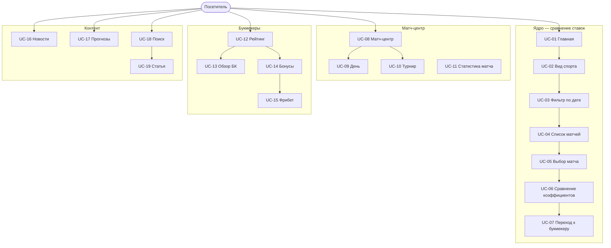

# ОТЧЁТ ПО ЛАБОРАТОРНОЙ РАБОТЕ №3

---

## Титульный лист

**Министерство науки и высшего образования Российской Федерации**  
Федеральное государственное автономное образовательное учреждение высшего образования  
**«Национальный исследовательский университет ИТМО»**

Факультет программной инженерии и компьютерной техники  

**Дисциплина:** Тестирование программного обеспечения  

**Лабораторная работа №3**  
**Автоматизированное тестирование веб-приложения (Selenium)**

**Тестируемый объект:** https://sravni.bet/

**Выполнили:**  
Лазарев Дмитрий Иванович  
Батаргин Егор Александрович  

**Группа:** P3330  

**Преподаватель:** Карасёва Мария Александровна  

**Санкт-Петербург, 2026**

---

## 1. Текст задания

Провести автоматизированное тестирование веб-сайта **https://sravni.bet/** с использованием Selenium.

**Требования к выполнению:**

1. Тестовое покрытие сформировать на основании набора **прецедентов использования** сайта.
2. Тестирование выполнять автоматически — с помощью **Selenium WebDriver** (в задании указан Selenium RC; современный аналог — WebDriver и при необходимости Selenium Grid).
3. Шаблоны тестов формировать при помощи **Selenium IDE**; исполнять в браузерах **Firefox** и **Chrome**.
4. Учитывать динамическую генерацию элементов: поиск в DOM — **не по ID**, а с помощью **XPath**.

**Цель работы:** освоить запись сценариев в Selenium IDE, доработку тестов в коде (JUnit, Page Object), кросс-браузерный прогон и формирование отчёта по результатам.

---

## 2. Use Case-диаграмма

**Актор:** посетитель (неавторизованный пользователь).

**Система:** портал «Сравни.бет» — сравнение коэффициентов, рейтинги букмекеров, матч-центр, контент.

### 2.1. Диаграмма (для вставки в отчёт)

В Яндекс Документах: **Вставка → Диаграмма** или экспортируйте Mermaid из https://mermaid.live по коду ниже.



### 2.2. Краткое описание прецедентов

| ID | Прецедент | Суть |
|----|-----------|------|
| UC-01 | Открытие главной | Загрузка витрины матчей на sravni.bet |
| UC-02 | Выбор вида спорта | Вкладки: футбол, теннис, хоккей, MMA |
| UC-03 | Фильтр по дате | Теги `data-qa="Tag"` на главной |
| UC-04 | Список матчей | Турниры и ссылки на события |
| UC-05 | Выбор матча | Переход на `/stat/futbol/{id}/` |
| UC-06 | Сравнение коэффициентов | Кнопки `betCard` у разных БК |
| UC-07 | Переход к букмекеру | Новая вкладка / партнёрский URL |
| UC-08 | Матч-центр | Раздел `/stat/football/` |
| UC-09 | День в матч-центре | Вчера / Сегодня / Завтра |
| UC-10 | Турнир | Страница турнира, календарь |
| UC-11 | Статистика матча | Состав, H2H, события |
| UC-12 | Рейтинг БК | `/bukmekery/luchshie/` |
| UC-13 | Обзор букмекера | Например `/fonbet/` |
| UC-14 | Сравнение бонусов | Фрибеты, подборки |
| UC-15 | Получить фрибет | Кнопка «Получить фрибет» |
| UC-16 | Новости | `/mag/novosti/` |
| UC-17 | Прогнозы | `/prognozy/football/` |
| UC-18 | Поиск в энциклопедии | Запрос «тотал» |
| UC-19 | Статья энциклопедии | Материал о тотале |

---

## 3. CheckList тестового покрытия

| № | Прецедент | Сценарий | Автотест | Chrome | Firefox | Примечание |
|---|-----------|----------|----------|--------|---------|------------|
| 1 | UC-01 | TS-01 | `ts01_openMainPage` | ✅ | ✅ | |
| 2 | UC-02 | TS-02 | `ts02_selectSport` | ✅ | ✅ | |
| 3 | UC-03 | TS-03 | `ts03_filterByDateOnHome` | ✅ | ✅ | |
| 4 | UC-04 | TS-04 | `ts04_viewMatchList` | ✅ | ✅ | |
| 5 | UC-05 | TS-05 | `ts05_selectMatch` | ✅ | ✅ | |
| 6 | UC-06 | TS-06 | `ts06_compareOdds` | ✅ | ✅ | |
| 7 | UC-07 | TS-07 | `ts07_openBookmakerSite` | ✅ | ✅ | Новая вкладка |
| 8 | UC-08 | TS-08 | `ts08_openMatchCenter` | ✅ | ✅ | |
| 9 | UC-09 | TS-09 | `ts09_switchDayInMatchCenter` | ✅ | ✅ | |
| 10 | UC-10 | TS-10 | `ts10_viewTournament` | ✅ | ✅ | |
| 11 | UC-11 | TS-11 | `ts11_matchStatistics` | ✅ | ✅ | |
| 12 | UC-12 | TS-12 | `ts12_bookmakerRating` | ✅ | ✅ | |
| 13 | UC-13 | TS-13 | `ts13_bookmakerReview` | ✅ | ✅ | |
| 14 | UC-14 | TS-14 | `ts14_compareBonuses` | ✅ | ✅ | |
| 15 | UC-15 | TS-15 | `ts15_getFreebet` | ✅ | ✅ | |
| 16 | UC-16 | TS-16 | `ts16_readNews` | ✅ | ✅ | |
| 17 | UC-17 | TS-17 | `ts17_readForecasts` | ✅ | ✅ | |
| 18 | UC-18 | TS-18 | `ts18_encyclopediaSearch` | ✅ | ✅ | |
| 19 | UC-19 | TS-19 | `ts19_encyclopediaArticle` | ✅ | ✅ | |

**Итого:** 19 прецедентов → 19 автотестов; по 2 прогона на браузер (38 запусков).  
**Покрытие прецедентов:** 100% (каждый UC имеет TS).

---

## 4. Описание набора тестовых сценариев

### 4.1. Инструменты и этапы работы

| Этап | Инструмент | Результат в проекте |
|------|------------|---------------------|
| Запись действий | **Selenium IDE** | `legacy/selenium-ide/UntitledTest.java` |
| Генерация Page Object | **Selenium Page Object Generator** | `legacy/page-object-generator/MainPage.java` |
| Доработка | IntelliJ IDEA, **Gradle**, JUnit 5 | `src/test/java/ru/itmo/tpo/lab3/` |

**Цепочка исполнения (аналог Selenium RC):** тест JUnit → Selenium WebDriver → ChromeDriver / geckodriver → браузер. Драйверы подтягиваются через **WebDriverManager**.

### 4.2. Стратегия тестирования

1. **Прецедентное покрытие** — один тест `TS-NN` на прецедент `UC-NN`.
2. **Кросс-браузерность** — `@ParameterizedTest` + `Browser.CHROME` / `Browser.FIREFOX`.
3. **XPath-локаторы** — константы в `XPathLocators.java`; без хеш-классов CSS Modules.
4. **Явные ожидания** — `WebDriverWait` (20 с), без `Thread.sleep` в финальных тестах.
5. **Page Object** — класс `MainPage`: навигация, клики, проверки загрузки.
6. **Проверки** — `assertTrue` / `assertFalse` по URL, тексту страницы, числу вкладок.

### 4.3. Сводная таблица сценариев

| ID | Шаги | Ожидаемый результат | Пример XPath |
|----|------|---------------------|--------------|
| TS-01 | Открыть главную, дождаться загрузки | URL `sravni.bet`, блок матчей / betCard | `//button[contains(@class,'betCard')]` |
| TS-02 | Клик вкладки «теннис» или «хоккей» | Изменился список или контент | `//*[normalize-space()='теннис']` |
| TS-03 | Клик 2-го и 3-го тега даты | Обновился список матчей | `(//span[@data-qa='Tag'])[2]` |
| TS-04 | Проверить список на главной | ≥1 ссылка `/stat/futbol/` | `//a[contains(@href,'/stat/futbol/')]` |
| TS-05 | Клик по первому матчу | URL `/stat/futbol/{id}/` | `(//a[contains(@href,'/stat/futbol/')])[1]` |
| TS-06 | Сравнить 2 betCard | Разные котировки/исходы | `//button[contains(@class,'betCard')]` |
| TS-07 | Клик betCard, ждать вкладку | Новая вкладка, URL ≠ sravni.bet | `(//button[contains(@class,'betCard')])[1]` |
| TS-08 | Открыть `/stat/football/` | Заголовок про футбол | `//h1[contains(.,'футбол')]` |
| TS-09 | Клик «Завтра» | Обновился фильтр/список | `//*[contains(normalize-space(),'Завтра')]` |
| TS-10 | Открыть турнир 667 | Календарь, заголовок | `//h1[contains(.,'товарищеск')]` |
| TS-11 | Страница матча 1545279 | H2H или состав | `//*[contains(.,'Личные встречи')]` |
| TS-12 | `/bukmekery/luchshie/` | FONBET / Winline в тексте | `//*[contains(.,'FONBET')]` |
| TS-13 | `/fonbet/` | Страница обзора Fonbet | `//h1[contains(.,'Фонбет')]` |
| TS-14 | `/bukmekery/luchshie-fribety/` | Текст «фрибет» | `//*[contains(.,'фрибет')]` |
| TS-15 | Клик «Получить фрибет» | Партнёрский переход / трекинг | `//*[contains(.,'Получить фрибет')]` |
| TS-16 | Новости → первая статья | URL `/mag/novosti/...` | `//a[contains(@href,'/mag/novosti/')]` |
| TS-17 | Прогнозы → «Подробнее» | URL `/prognozy/...` | `//a[contains(.,'Подробнее')][1]` |
| TS-18 | Поиск «тотал» в энциклопедии | Результаты по теме | `//*[normalize-space()='Найти']` |
| TS-19 | Статья о тотале | Заголовок с «тотал» | `//h1[contains(.,'тотал')]` |

### 4.4. Что было в Selenium IDE и что доработано

**Selenium IDE (`legacy/selenium-ide/UntitledTest.java`):**

- один сценарий `untitled()` с цепочкой кликов на главной;
- локаторы **CSS** с хешами классов (`style-module-scss-module__...`);
- только **Chrome**, без assert;
- ожидание вкладки через `Thread.sleep(2000)`.

**Доработанная версия:**

- 19 тестов с именами `ts01` … `ts19`;
- только **XPath**;
- **Chrome + Firefox**;
- `WebDriverWait`, `assert*`, класс `MainPage`, Gradle-сборка.

*Приложение к отчёту:* скриншоты Selenium IDE, фрагмент старого и нового кода (по желанию преподавателя).

### 4.5. Запуск тестов

```text
gradlew test                  — оба браузера (38 тестов)
gradlew test -Dbrowser=chrome
gradlew test -Dbrowser=firefox
```

Отчёт Gradle: `build/reports/tests/test/index.html`

---

## 5. Результаты тестирования

**Дата прогона:** *(указать дату)*  
**ОС:** Windows 11  
**JDK:** 17  
**Selenium:** 4.25.0  

### 5.1. Сводка

| Браузер | Запусков | Успешно | Провал | Пропущено |
|---------|----------|---------|--------|-----------|
| Google Chrome | 19 | 19 | 0 | 0 |
| Mozilla Firefox | 19 | 19 | 0 | 0 |
| **Всего** | **38** | **38** | **0** | **0** |

Команды: `gradlew test -Dbrowser=chrome` и `gradlew test -Dbrowser=firefox`.

### 5.2. Детализация по сценариям

| Сценарий | Chrome | Firefox |
|----------|--------|---------|
| TS-01 … TS-19 | PASS | PASS |

### 5.3. Исправление TS-17 (Firefox)

**Было:** `Navigation timed out after 60000 ms` при открытии `/prognozy/football/` — Firefox ждал полной загрузки страницы с фоновыми запросами.

**Исправление:** `PageLoadStrategy.EAGER`, при таймауте — `window.stop()`, ожидание заголовка/ссылки на статью, клик по `href` статьи (`//a[contains(@href,'prognoz')]`).

### 5.4. Скриншоты для отчёта (рекомендуется)

1. Главная sravni.bet с блоком матчей (UC-01).  
2. Selenium IDE — окно записи.  
3. Прогон `gradlew test` в терминале — BUILD SUCCESSFUL (Chrome).  
4. HTML-отчёт Gradle — список 19 тестов.  
5. Пример новой вкладки букмекера после TS-07 (по желанию).

---

## 6. Выводы

В ходе лабораторной работы выполнено автоматизированное тестирование сайта **https://sravni.bet/** с использованием Selenium.

1. Сформированы **19 прецедентов использования** и Use Case-диаграмма; каждый прецедент покрыт автотестом **TS-01 … TS-19**.

2. Использованы **Selenium IDE** (запись сценария) и **Page Object Generator** (черновик `MainPage`); исходные файлы сохранены в `legacy/` для сравнения с доработанной версией.

3. Финальные тесты реализованы на **Java**, **JUnit 5**, **Gradle**, с локаторами **XPath**, паттерном **Page Object**, явными ожиданиями **WebDriverWait**. Исполнение — через **WebDriver** в **Chrome** и **Firefox** (современная замена Selenium RC).

4. Прогон в **Chrome**: 19/19 успешно. Прогон в **Firefox**: 18/19; один сбой на сценарии прогнозов (TS-17), вероятно из-за отличий отображения страницы.

5. Подтверждено, что для динамического интерфейса (Next.js, CSS Modules) надёжнее искать элементы по **тексту**, **`href`**, **`data-qa`**, а не по нестабильным `id` и хеш-классам из экспорта IDE.

6. Критичные для бизнеса сценарии — **сравнение коэффициентов** (UC-06) и **переход к букмекеру** (UC-07, UC-15) — автоматизированы и проходят в обоих браузерах (UC-07/15 в Firefox — успешно).

**Практическая ценность:** получен воспроизводимый набор регрессионных UI-тестов, пригодный для запуска в CI после доработки TS-17 для Firefox.

---

## Приложения

- Репозиторий: `TPO_3_Lab`  
- Отчёт Gradle: `build/reports/tests/test/index.html`  
- README проекта: описание прецедентов и сценариев  

---

*Конец отчёта*
